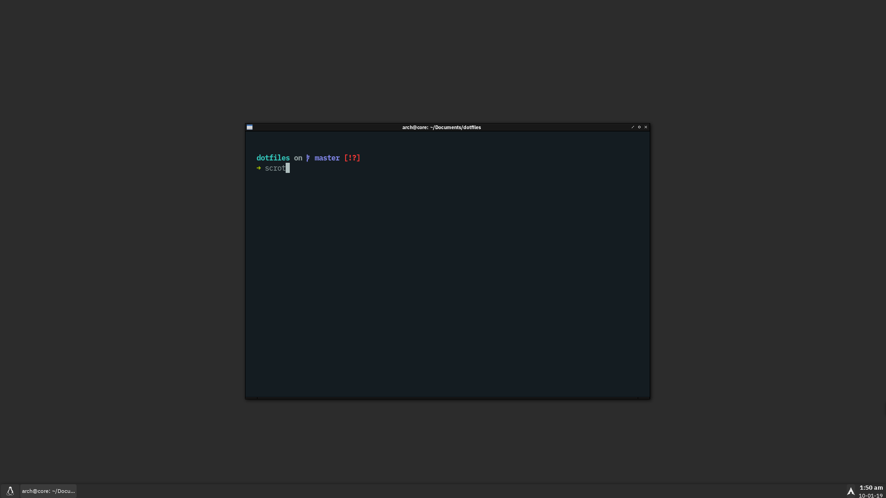

# dotfiles
[Theme](https://www.box-look.org/p/1017737/)

[spaceship-prompt](https://github.com/denysdovhan/spaceship-prompt)

[Tint2 external dependency](https://github.com/nwg-piotr/t2ec) 

[Openbox menu](https://github.com/trizen/obmenu-generator)

# Credits
.Xresources based on [this article.](https://addy-dclxvi.github.io/post/configuring-urxvt/) 
